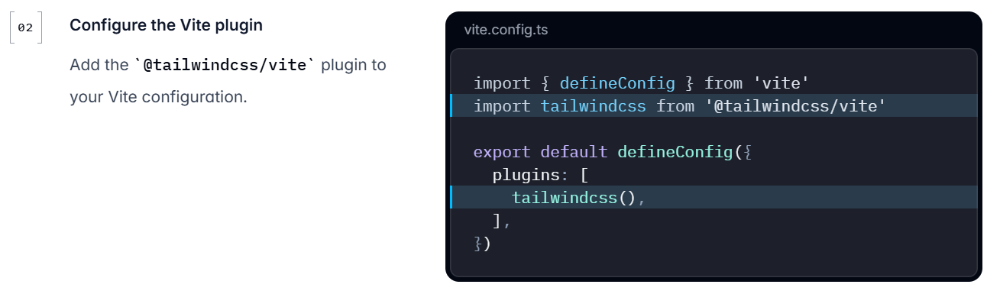
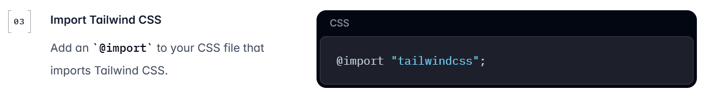

# 課題管理アプリ
* 課題をlistを利用し管理するアプリを作る。
* フロント：react(Typescript), バック：Go
* 画面イメージ図  

  

## 環境構築  
※ すでにwsl, npm, dockerはインストールされている。

1. viteによるプロジェクト(frontendフォルダ)の作成  
`npm create vite@latest frontend -- --template react-ts`  
`cd frontend`    
`npm install`  

2. Dockerfileおよびdocker-compose.ymlは各フォルダ参照  

3. dockerのbuildおよび起動  
`docker compose up --build`  
or  
起動のみ：`docker compose up`   

4. Tailwind CSSのインストールと設定  
`npm install tailwindcss @tailwindcss/vite`  
`npm install tailwindcss @tailwindcss/cli`  
`ls -l node_modules/.bin`  
適当なinput.css(空でよい)を作成し`npx tailwindcss build input.css -o output.css`を実行  
cli,ls,npxのほうは、nodemodules/.binにtailwindcssを入れるために実行している。  
上記実行後、vite.config.tsに下記編集を加える  
  
次にindex.cssに下記を加える（実施済み）
  
終わったら再度、3を行う。(dockerのbuildとup)  
参照：  
〈公式〉https://tailwindcss.com/docs/installation/using-vite  
https://zenn.dev/mishima3141/articles/65668245241953  
https://qiita.com/shirokurotaitsu/items/732d2782048859a5a672  
https://www.youtube.com/watch?v=xExL5DnP_lA  
