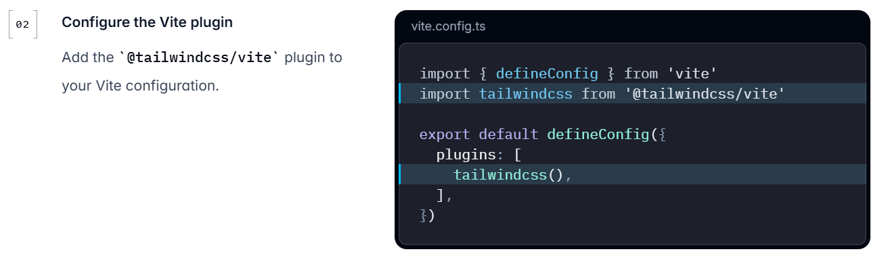
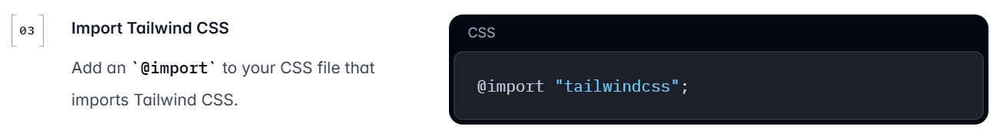

# 課題管理アプリ
## 背景  
各課題の管理を下図のようにexcelで表を作成し、チェックボックスにより管理を行っていた。  
しかし、表のみでは、期限がわからないため、別で確認する必要があったり、作成途中などの現在の状況把握まではできない。  
また、半期ごとにexcelの作成が必要であり、手間のかかる作業となる。  
そこで、期限の確認と現在の状態管理、そして表の作成が簡単にできるようにするために、これらの機能を搭載したwebアプリを作成した。  
これにより、全体の把握が容易になるため、出し忘れの防止や、余裕を持った行動を行うことができることを期待している。   

  

## 目的  
タスク管理を科目ごとに期限等を把握できるページと、それをもとに表により一括管理ができるページを作成するwebアプリを作成することを目的とする。  

## サービス概要  
* タスク管理を目的にする人向けに、課題管理を一括で行えるタスク一覧および表を作成。  
* 期限、状態を一括で管理可能。  

## 画像イメージ  

  

## 動作イメージ   
https://github.com/user-attachments/assets/1ef53257-6330-4bb6-985e-81f3bb481d27  

## 機能  

## 環境構築  
※ すでにwsl, npm, dockerはインストールされている。

1. viteによるプロジェクト(frontendフォルダ)の作成  
`npm create vite@latest frontend -- --template react-ts`  
`cd frontend`    
`npm install`  

2. Tailwind CSSのインストールと設定  
`npm install tailwindcss @tailwindcss/vite`  
`npm install tailwindcss @tailwindcss/cli`  
`ls -l node_modules/.bin`  
適当なinput.css(空でよい)を作成し`npx tailwindcss build input.css -o output.css`を実行  
cli,ls,npxのほうは、nodemodules/.binにtailwindcssを入れるために実行している。  
上記実行後、vite.config.tsに下記編集を加える  
  
次にindex.cssに下記を加える（実施済み）
 

3. Dockerfileおよびdocker-compose.ymlは各フォルダ参照  

4. dockerのbuildおよび起動  
`docker compose up --build`  
or  
起動のみ：`docker compose up`   

参照：  
〈公式〉https://tailwindcss.com/docs/installation/using-vite  
https://zenn.dev/mishima3141/articles/65668245241953  
https://qiita.com/shirokurotaitsu/items/732d2782048859a5a672  
https://www.youtube.com/watch?v=xExL5DnP_lA  
